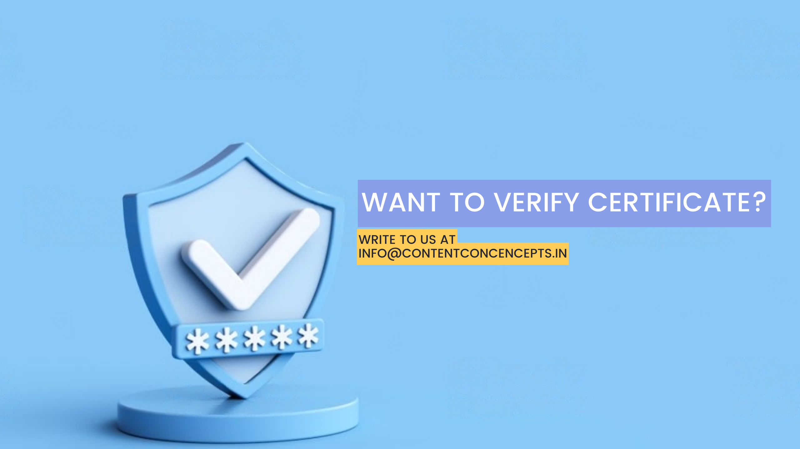

**Editing Certificate Verification**

Welcome to the Editing Certificate Verification page. If you've reached this page, you're here for certificate verification, and we're delighted to assist you in this process.

**Verification Process:**

To initiate the Editing certificate verification process, please follow these simple steps:

1. **Send an Email:** Send an email to [info@contentconcepts.in](mailto:info@contentconcepts.in) with the following details:

   * Your Full Name
   * Certificate ID (if available)
   * Contact Information (Email)
   * Brief description of the certificate you'd like to verify
2. **[Submit Form](https://contentconcepts.in/contact/):** Alternatively, you can use our online submission form by visiting our official website: [www.contentconcepts.com](https://www.contentconcepts.com/). Look for the "Certificate Verification" section and provide the requested details.

**Why Verify?**

Certificate verification is crucial to ensure the authenticity and credibility of your [editing certificate](https://contentconcepts.com/blog/free-english-editing-certificate). By undergoing this process, you can be confident in the legitimacy of your achievements and showcase your skills with pride.

Our team is committed to providing a seamless verification experience. If you have any questions or need assistance, feel free to reach out to us. We're here to help you every step of the way.

Thank you for choosing Content Concepts for your [editing certificate](https://contentconcepts.com/blog/free-english-editing-certificate) verification. Let's validate your accomplishments together!