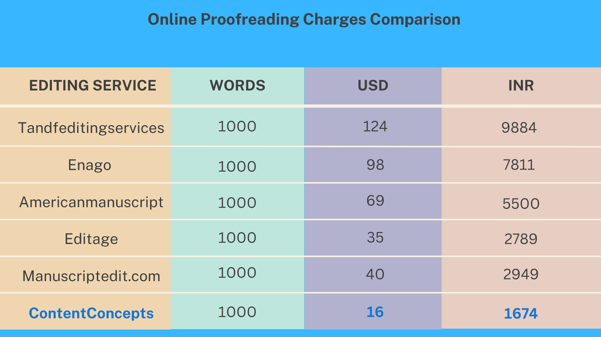

[Proofreading](https://contentconcepts.in/services/academic_editing/proofreading_service/) is a crucial step in ensuring the quality and professionalism of written content. If you're in India and seeking proofreading services, you might be wondering about the cost involved. In this article, we'll delve into the factors that determine the cost of proofreading in India and provide you with valuable insights. Read on to discover how much you can expect to invest in this essential service.

### **1. How is the proofreading fee determined?**

 The proofreading fee is determined based on several factors. One important consideration is the [word count](https://contentconcepts.in/pricing/#pricing) of your document. Typically, figures, tables, and references are not included in the editing fee. To receive an accurate quote, it's advisable to remove any sections you don't want to be edited before submitting your manuscript. Additionally, the level of editing required for your manuscript plays a role in determining the fee. Different editing service providers may offer various levels, such as proofreading or substantive editing.

### **2. What is the price range for proofreading in India?**

The price range for proofreading in India can vary depending on the service provider and the level of editing required. On average, the cost per page or per word falls within a competitive range compared to other countries. It's important to compare prices and services offered by different providers to ensure you get the best value for your investment.

### **3. How does the location of the editing service provider affect the cost?**

 The location of the editing service provider is a significant factor in determining the cost of proofreading. Typically, countries like the US, UK, and Europe tend to have higher charges due to their financial status and economy. However, in recent years, India has emerged as a hub for proficient English editors who possess native-level language skills. This has led to more affordable proofreading options without compromising on quality.

### **4. Can I expect high-quality proofreading services in India?**

 Absolutely! With the increasing number of English speakers and professionals in India, the country now boasts native-level English editors who can provide top-notch proofreading services. Many of these editors have acquired the necessary skills and expertise to meet international standards. Rest assured that you can find qualified professionals who deliver excellent results, ensuring your content is polished and error-free.

### Best and trusted proofreading service

When it comes to proofreading in India, the cost can vary based on factors such as word count, level of editing required, and the location of the service provider. It's crucial to choose a reliable and experienced proofreading service that offers competitive pricing without compromising on quality. By investing in [professional proofreading](https://contentconcepts.in/services/academic_editing/proofreading_service/), you can elevate the standard of your written content and make a lasting impression on your readers. So, take the next step towards perfecting your work and discover the immense benefits that come with it.