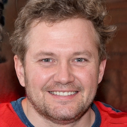
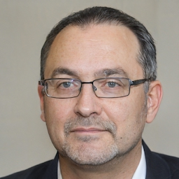
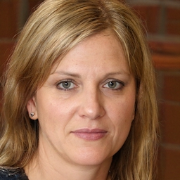
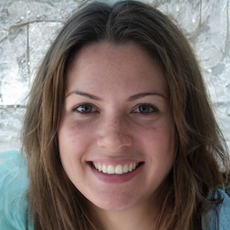
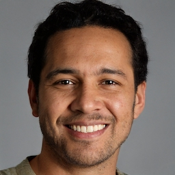
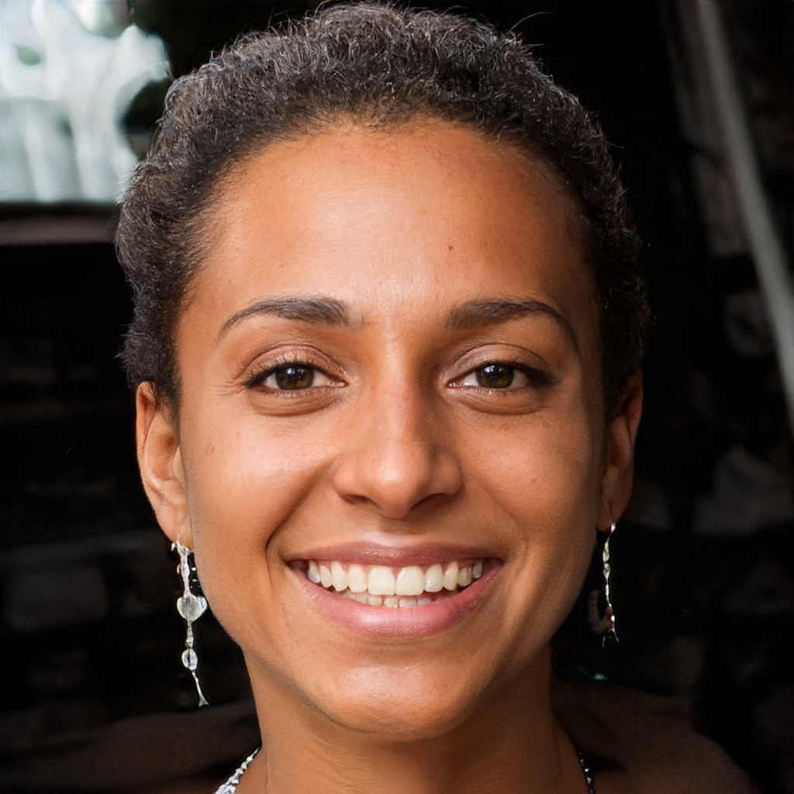
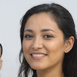
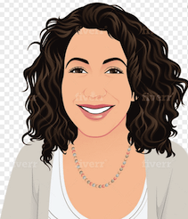

At ContentConcepts, we take pride in our team of exceptional editors who are dedicated to enhancing the quality of your written content. Each editor has been carefully selected for their expertise and experience in specific fields. Allow us to introduce our talented editors:

### Ross Taylor - Native English & Manuscript Editor

Ross is a highly skilled [native English editor](https://contentconcepts.in/services/academic_editing/english_editing/) with a background in linguistics and engineering. Specializing in science, medical, and technology manuscripts, Ross brings a meticulous approach to editing. With a certification in teaching English as a foreign language, he ensures clarity and precision in your work.

### Alan Wichelman - Native English Editor - Business, Management & Marketing

Meet Alan, our native English editor who excels in flawlessly written corporate documents and correspondence. As a licensed attorney, he also imparts reader-friendly, plain English drafting skills to non-American lawyers. Alan's expertise in business, management, and marketing guarantees exceptional editing results.

### Dr. Carole J - Manuscript Editor - Life Sciences & Medicine (Biology Editor)

Dr. Carole is a meticulous [medical editor](https://contentconcepts.in/services/academic_editing/medical_editing/) with outstanding professional and research experience across prestigious academic institutions. Having conducted research at renowned institutions like Harvard Medical School and Columbia University, her expertise in life sciences and medicine ensures the highest quality editing for your manuscripts.

### Dr. Katharine Hughes - Scientific Editor - Life Science Biosciences, Bio-Engineering

With over 25 years of experience, Dr. Katharine is a seasoned expert in [scientific editing](https://contentconcepts.com/services/academic_editing/scientific_manuscript_editing/) academic papers, theses, and dissertations. Specializing in ESL documents and a wide range of fields, including medical sciences, IT, and bioinformatics, she brings a wealth of knowledge to ensure accuracy and clarity in scientific writing.

### Dr. Ashraf - Scientific & Statistics Editor (Medical Paper Editor)

Dr. Ashraf holds a doctoral degree in Biostatistics and has extensive academic experience  in [editing medical manuscript](https://contentconcepts.in/services/academic_editing/medical_editing/). With numerous research publications and meticulous attention to detail, he is a certified editor and ensures the highest standards in editing medical papers and research with statistical analysis.

### Dr. Monika Mukherjee - Scientific Editor - Biochemistry & Pharmacology

Dr. Monika is a highly experienced scientist with a Ph.D. in Pharmacology and over 20 years of expertise in leading pharmaceutical labs. Specializing in ESL writing and [medical editing,](https://contentconcepts.in/services/academic_editing/medical_editing/) she brings a deep understanding of biochemistry and pharmacology to elevate the quality of scientific content.

### Dr. Athira, Ph.D - Thesis Editor - Biological Sciences

Dr. Athira holds a doctoral degree in Biotechnology and has a wealth of academic experience and research publications. As a meticulous editor, she has helped numerous clients successfully publish their research papers and theses by providing detailed observations and valuable guidance.

### Dr. Nalini Kannan, Ph.D - [Thesis Editor](https://contentconcepts.in/services/academic_editing/thesis_editing/) - Science

Dr. Nalini brings extensive writing and editing experience from her 20-year career as a scientist in a leading biotechnology lab. With expertise in various academic documents and clinical research trials, she ensures precision and clarity in scientific writing to help you achieve your thesis goals.

### Alan Wichelman - [Thesis Editor](https://contentconcepts.in/services/academic_editing/thesis_editing/) - Business & Management

As a native English editor, Alan specializes in flawless research writing and editing skills for theses. With a vast portfolio of editing over 100 theses, he is well-versed in various formatting requirements, including APA and the Chicago Manual. Trust Alan to refine your thesis with utmost professionalism.

With our team of expert editors, we guarantee the highest quality editing services to meet your specific needs. Elevate the impact and clarity of your written content with ContentConcepts.