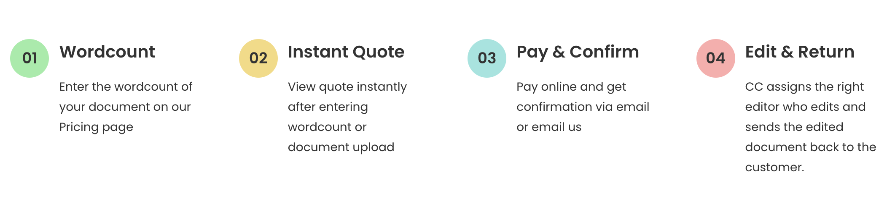

Here is a brief overview of our English Editing process - a two-step process performed by the editor and proofreader. Our comprehensive editing and proofreading process will ensure your document is polished to perfection, with no grammar gremlins or sneaky typos left behind. So, buckle up and get ready for a wild ride through the magical world of manuscript transformation. Let's dive into the details of our two-step editing extravaganza!

## **Step 1: Polishing Your Document - Because Grammar is Tricky, But We've Got Your Back!**

Alright, let's get down to business! We'll hook you up with a manuscript editor who knows their stuff and is well-versed in your subject. They'll work their magic and fix the following pesky issues:

* Grammar and punctuation blunders (we'll put those rogue commas and misplaced apostrophes in their place)
* Spelling slip-ups and technical term mix-ups (we won't let those sneak past us)
* Tricky verb tenses, articles, and commas (seriously, who needs all that confusion?)
* Referencing and formatting according to APA, Chicago, IEEE, and other styles (we've got those guidelines memorized)
* Overall structure of your paper, because we want it to flow like a boss and have smooth section transitions (cue the paper symphony)

## **Step 2: Proofreading - Because Typos Are Sneaky Little Devils**

Now, we bring in another superhero, a proofreader extraordinaire! Their mission is to scour your document for any sneaky typos and ensure everything is on point. They'll check the spelling and make sure your words are consistent throughout, whether you prefer British English or American English (we've got love for both). We want your document to be squeaky clean, leaving no room for confusion. So, when you communicate, it's crystal clear and nothing less than complete awesomeness.

## Manuscript Submission Process 

