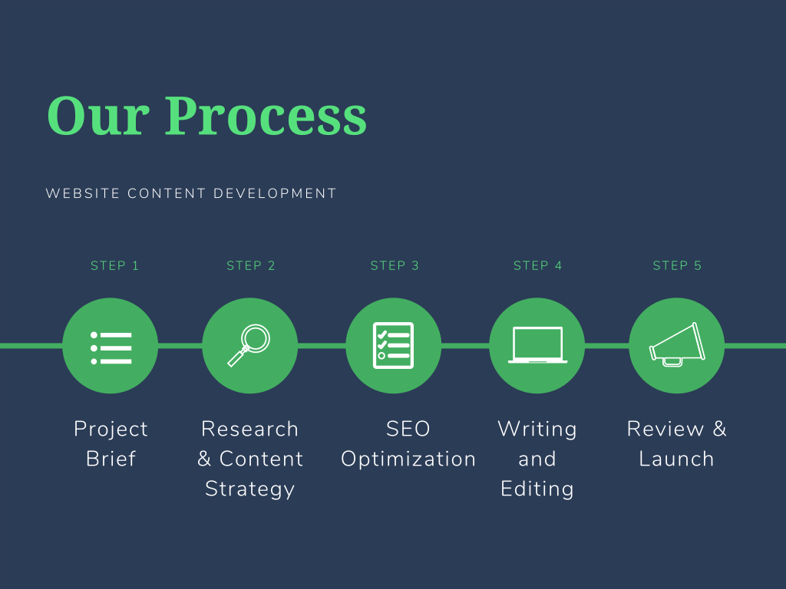

We understand the frustration of pouring your heart into a project, only to see it fall flat due to lackluster content. But fear not, because we have the solution you've been longing for. Our team of skilled and passionate wordsmiths will weave enchanting narratives, craft compelling copy, and infuse your brand with an irresistible voice. We know how to evoke emotions, ignite curiosity, and leave a lasting impression on your readers.

Here is our website content development process:

* Project Brief: Gather information about the client's business, target audience, goals, and desired tone/style for the website copy.
* Research: Conduct thorough research on the client's industry, competitors, target market, and keywords to inform the writing process.
* Content Strategy: Develop a content strategy that outlines the overall structure, messaging, and key points for each page of the website.
* Wireframe Review: Collaborate with designers and web developers to review wireframes or page layouts to understand how the copy will be integrated into the website.
* SEO Optimization: Incorporate relevant keywords and optimize the copy to improve search engine visibility and organic rankings.
* Writing and Editing: Write compelling, engaging, and concise copy for each page of the website, keeping in mind the target audience and brand voice. Edit and proofread the content for grammar, spelling, and clarity.
* Collaboration: Communicate and collaborate with the design and development team to ensure seamless integration of the copy into the website.
* Client Review and Feedback: Share the initial draft of the website copy with the client for review and incorporate their feedback and revisions as necessary.
* Finalize and Publish: Make any necessary edits or revisions based on client feedback and finalize the copy. Work closely with the development team to ensure the smooth publication of the website content.
* Post-launch Support: Provide ongoing support and revisions after the website goes live to ensure the content remains up to date and aligned with the client's evolving needs.

Take the first step towards success and contact us today. Together, let's create a narrative that will leave your readers spellbound, your competitors envious, and your dreams within reach.