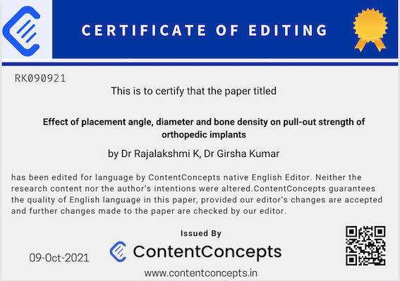

An English Editing Certificate is a valuable asset for academic authors, serving as proof that a skilled English language editor has meticulously reviewed and refined your work. At ContentConcepts, we proudly provide this certificate for free, ensuring your document is polished and ready for submission. Our commitment to language accuracy and expert editing guarantees error-free papers, solidifying our reputation as a trusted name in the field.

1. **What is the purpose of an editing certificate?** An editing certificate serves as proof of professional English language editing, enhancing the credibility of your academic work.
2. **What does an English editing certificate certify?** Our certificate certifies that your document has been meticulously edited to the highest standards by ContentConcepts' expert editors.
3. **How can I obtain a certificate of editing from ContentConcepts?** Simply submit your document for our editing services, and we'll provide a free English Editing Certificate.
4. **What information is included in the editing certificate provided by ContentConcepts?** The certificate includes the paper title, authors, a declaration from our Chief Editor, editing date, and a QR code for validation.
5. **Why is it important to avoid making additional revisions after editing?** Avoiding revisions ensures the integrity of our 100% language accuracy guarantee.
6. **What guarantee does ContentConcepts provide regarding language accuracy?** We guarantee 100% language error-free papers, establishing us as a trusted name in academic editing and proofreading.
7. **How can I validate the editing certificate using the QR code?** Scan the QR code on the certificate to verify its authenticity.
8. **Is the English Editing Certificate provided by ContentConcepts free of charge?** Yes, the certificate is provided free of charge with our editing services.
9. **Will having an editing certificate guarantee the publication of my work?** While it doesn't guarantee publication, it can strengthen your submission by demonstrating expert review.
10. **How can the editing certificate benefit authors in the publishing process?** The certificate can increase your chances of peer-review by allowing editors to focus on scientific content rather than language errors.
11. **Does submitting an editing certificate increase the chances of peer-review for my paper?** Yes, a certificate can positively impact your chances of peer-review.
12. **How can ContentConcepts assist authors in achieving their publishing goals?** We offer professional editing services and English Editing Certificates to support authors in their publishing endeavors.
13. **What makes ContentConcepts a trusted name in academic editing and proofreading?** Our commitment to 100% language accuracy and expert editing sets us apart.
14. **Can I place an order with ContentConcepts to receive both professional editing and an English Editing Certificate?** Absolutely! Our services include both editing and the complimentary certificate.